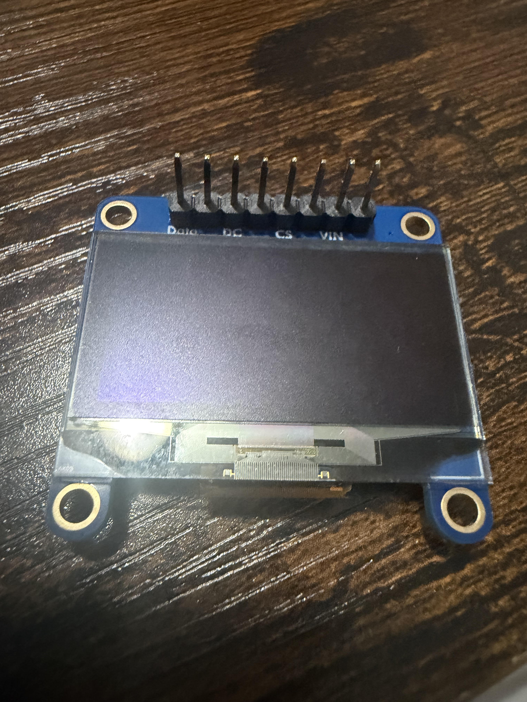
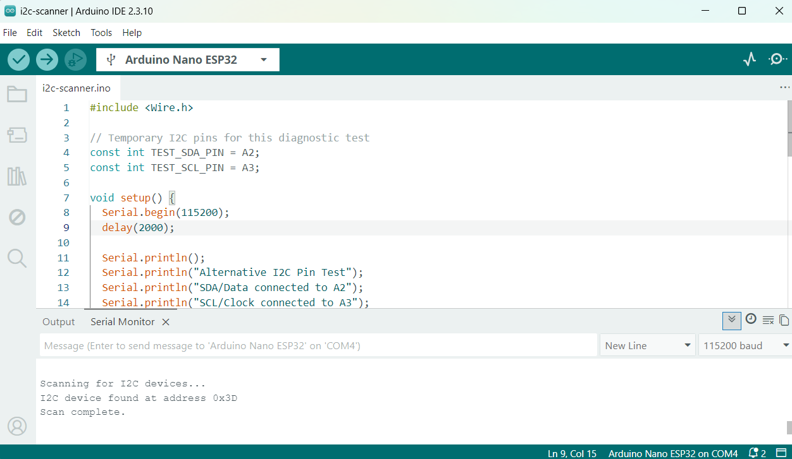
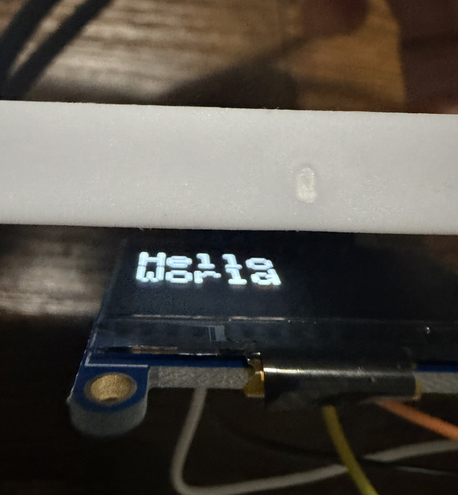

# Phase 2: OLED Assembly and Display Testing

## Objective

The objective of Phase 2 was to prepare the OLED module for breadboard use, establish I2C communication with the ESP32-based microcontroller, and verify that the display could show text.

## Hardware and Tools

- Arduino Nano ESP32
- Adafruit Monochrome 1.3-inch 128x64 OLED, Product ID 938
- Male header pins
- Soldering iron and solder
- Breadboard
- Jumper wires
- Digital multimeter
- USB-C data cable
- Arduino IDE

## Header-Pin Soldering

### Completed Soldering

 

Male header pins were positioned through the OLED breakout board and soldered into place. The completed joints were visually inspected for alignment, secure connections, and unintended solder bridges.

This provided the mechanical and electrical connections required to use the OLED on a solderless breadboard.

## OLED Controller and Libraries

The Adafruit Product 938 display uses an SSD1306 controller.

The following libraries were used:

- Adafruit SSD1306
- Adafruit GFX Library
- Wire

## Initial Wiring

The original test used the Nano ESP32's default I2C pins:

| OLED | Original Nano connection |
|---|---|
| GND | GND |
| VIN | 3.3V |
| Data | A4/SDA |
| Clk | A5/SCL |

The OLED initially worked in this configuration, but later I2C scans did not detect the display.

## Troubleshooting

The following troubleshooting steps were performed:

1. Rechecked the OLED power and I2C wiring
2. Tested different jumper connections
3. Tested the circuit on another breadboard
4. Tested a replacement OLED
5. Measured approximately 3.26V between OLED VIN and GND
6. Tested both possible I2C addresses, 0x3C and 0x3D
7. Reassigned the I2C bus to different Nano ESP32 pins

The correct supply voltage showed that the OLED was receiving power. However, no acknowledgment was received through the original A4/A5 connection path.

## Final Working Wiring

The I2C bus was reassigned to A2 and A3:

| OLED | Final Nano connection |
|---|---|
| GND | GND |
| VIN | 3.3V |
| Data/SDA | A2 |
| Clk/SCL | A3 |

The program explicitly initialized this pin assignment using:

`Wire.begin(A2, A3);`

## I2C Test Result

### Successful I2C Detection

Using A2 for SDA and A3 for SCL, the I2C scanner successfully reported:

`I2C device found at address 0x3D`

This confirmed that the OLED, its soldered connections, power supply, I2C controller, and Nano ESP32 communication system were operational.

The fault was isolated to the original A4/A5 connection path, which may involve the physical pins, breadboard contacts, or original pin configuration.

## Display Test

After detecting the OLED at address `0x3D`, an SSD1306 display program was used to display “Hello World.”

### Successful Display Test

## Skills Practiced

- Through-hole header-pin soldering
- Solder-joint inspection
- Breadboard prototyping
- Voltage measurement with a digital multimeter
- I2C address scanning
- Alternative GPIO assignment
- Embedded display programming
- Systematic hardware fault isolation
- Technical documentation

## Result

Phase 2 established reliable I2C communication using A2 and A3 and identified the OLED at address `0x3D`.

The A2/A3 assignment will be retained in later project programs and wiring documentation.

## Next Phase

The next phase tests SPI communication between the Nano ESP32 and the MAX30003 ECG breakout board.

## Safety and Limitations

The system was disconnected from power before wiring changes were made. This project is intended for education and engineering experimentation and is not a certified medical device.
