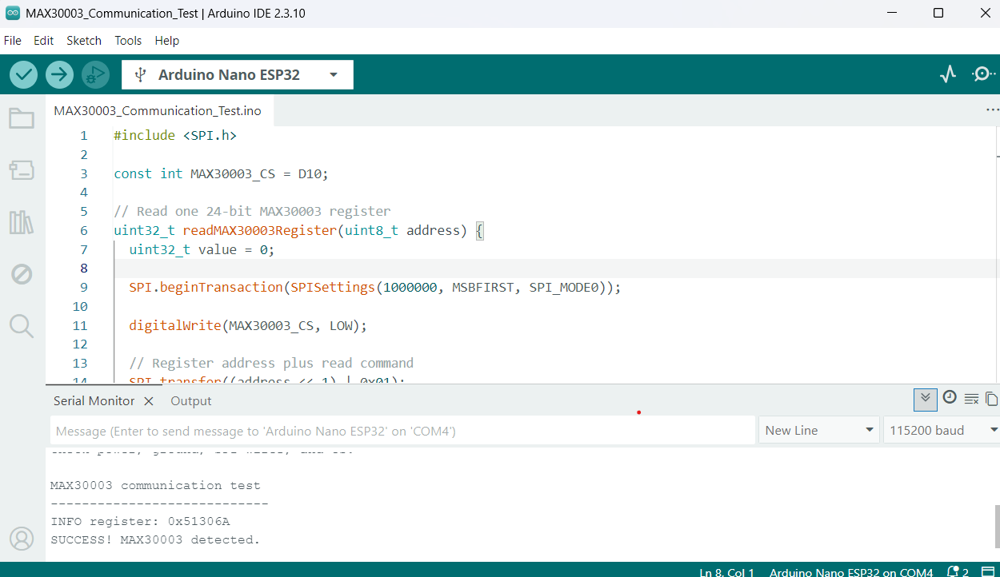
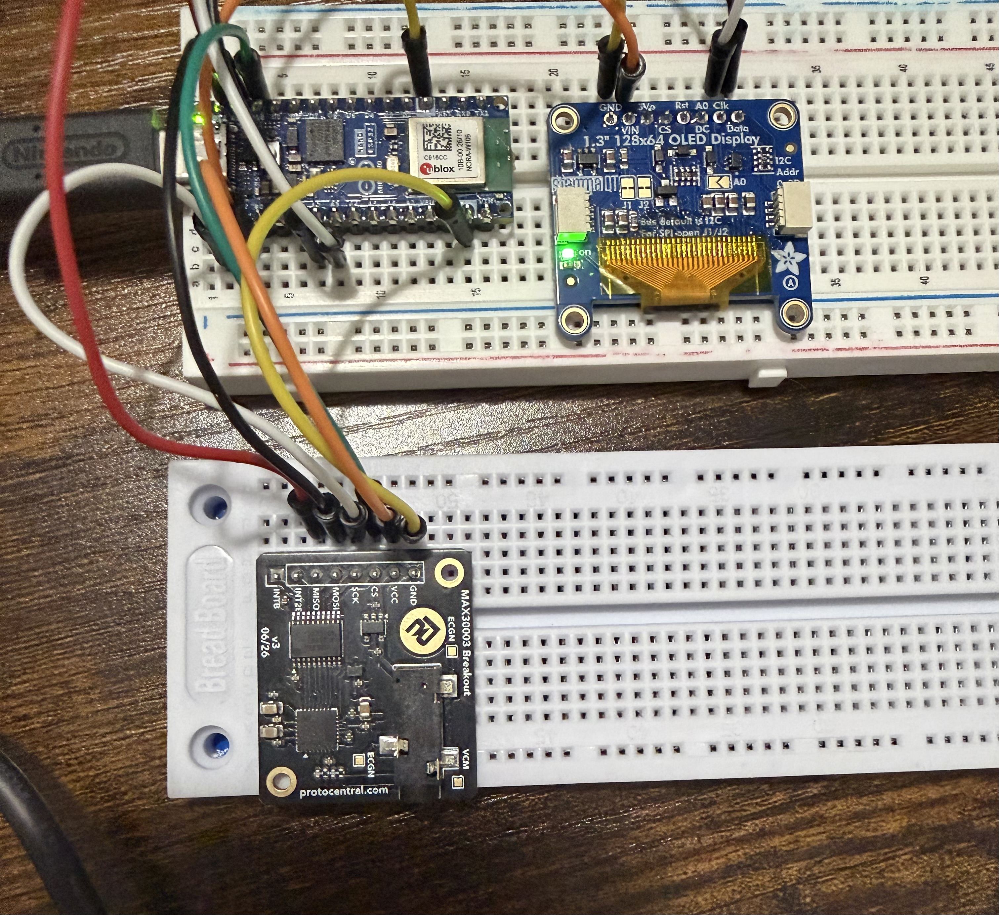

# Phase 3: MAX30003 SPI Communication Test

## Objective

The objective of Phase 3 was to connect the ProtoCentral MAX30003 ECG breakout v3 to the ESP32-based microcontroller and verify basic digital communication through SPI.

This phase tested communication with the ECG breakout before attempting electrode measurements, ECG acquisition, heartbeat detection, or BPM calculation.

## Hardware Used

- Arduino Nano ESP32
- ProtoCentral MAX30003 ECG Breakout v3
- Breadboard
- Jumper wires
- USB-C data cable
- Computer running Arduino IDE
- Digital multimeter for troubleshooting

## Communication Protocol

The MAX30003 communicates with the microcontroller through SPI.

The principal SPI signals are:

- SCK provides the communication clock
- MOSI carries data from the microcontroller to the MAX30003
- MISO carries data from the MAX30003 to the microcontroller
- CS selects the MAX30003 for communication

The microcontroller and MAX30003 must also share power and ground connections.

## Wiring

| MAX30003 | Nano ESP32 |
|---|---|
| VCC | 3.3V |
| GND | GND |
| SCK | D13/SCK |
| MOSI/SDI | D11/MOSI |
| MISO/SDO | D12/MISO |
| CS0/CSB | D10 |

The interrupt connection was not required for this initial register-communication test.

The OLED remained assigned to A2 for SDA and A3 for SCL, so its I2C wiring did not conflict with the MAX30003 SPI pins.

## Test Method

A test program initialized the SPI bus, selected D10 as the MAX30003 chip-select pin, and read the device's INFO register at address `0x0F`.

The program treated continuous values of `0x000000` or `0xFFFFFF` as evidence of a likely communication failure. A different returned value indicated that the microcontroller received data from the MAX30003.

## Test Result

The Serial Monitor displayed an INFO-register value and reported:

`SUCCESS! MAX30003 detected.`

This confirmed:

- MAX30003 power
- Common ground
- SPI clock connection
- MOSI connection
- MISO connection
- D10 chip-select connection
- Basic microcontroller-to-MAX30003 communication

## Successful Test Evidence

## Hardware Setup

## Skills Practiced

- SPI wiring
- Chip-select configuration
- Register-level device communication
- Breadboard prototyping
- Serial Monitor testing
- Hardware troubleshooting
- Incremental subsystem verification
- Technical documentation

## What This Test Did Not Prove

This test confirmed basic digital communication only.

It did not yet:

- Configure continuous ECG acquisition
- Read the ECG FIFO
- Verify an ECG waveform
- Detect heartbeats
- Calculate BPM
- Evaluate electrode placement
- Validate measurement accuracy

## Next Phase

The next phase will configure the MAX30003 for ECG acquisition, connect its interrupt output if required, read raw ECG samples, and display the samples in Arduino Serial Plotter.

## Safety and Limitations

No electrodes were attached to the body during this basic communication test.

This project is intended for education and engineering experimentation. It is not a certified medical device and must not be used for diagnosis or emergency decision-making.
