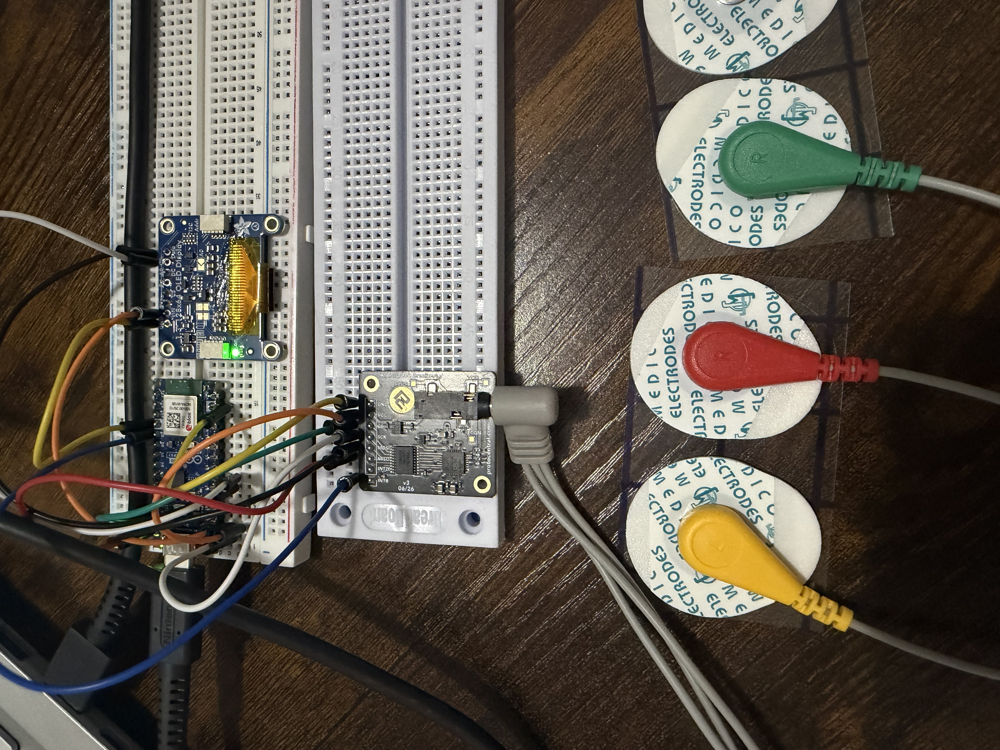
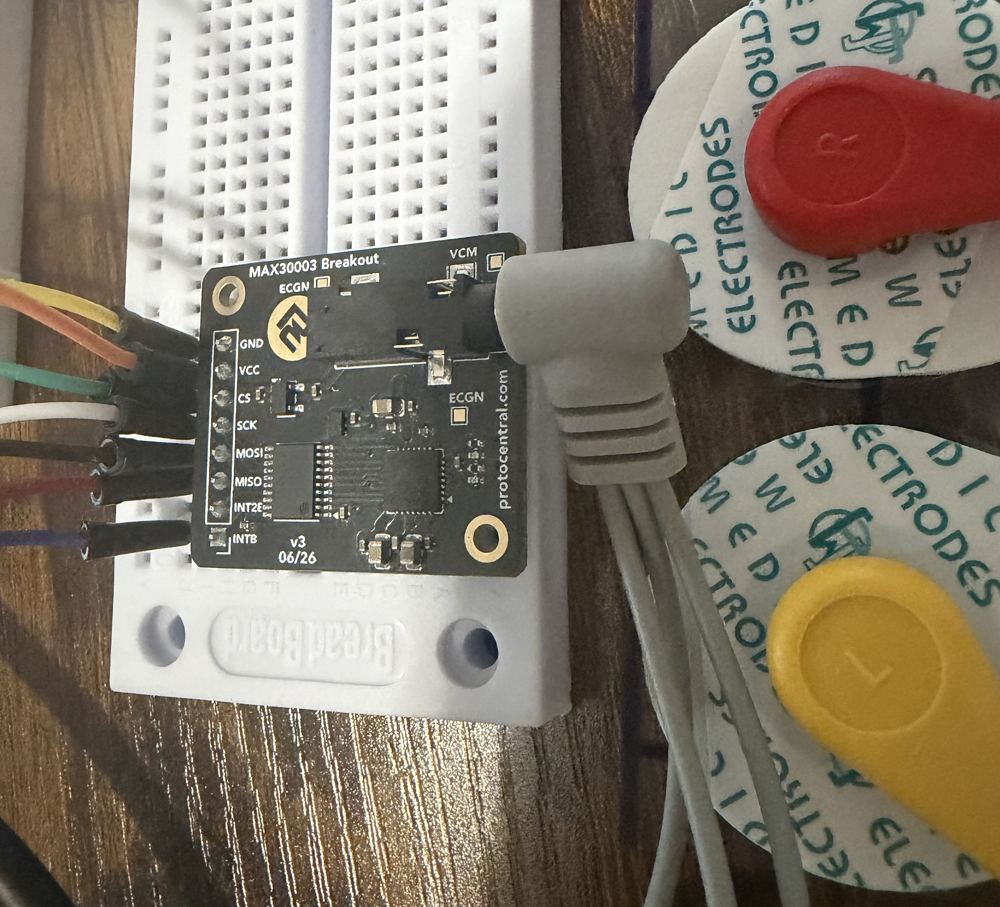
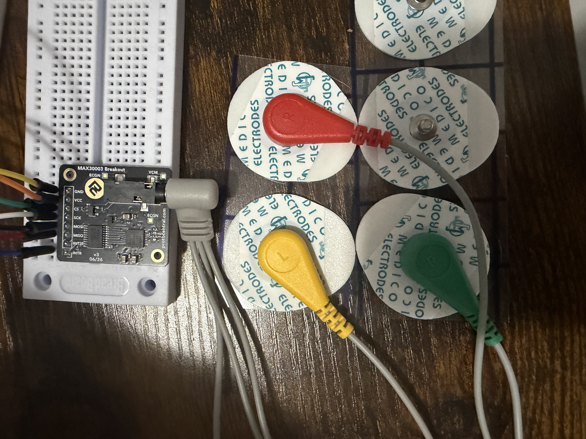
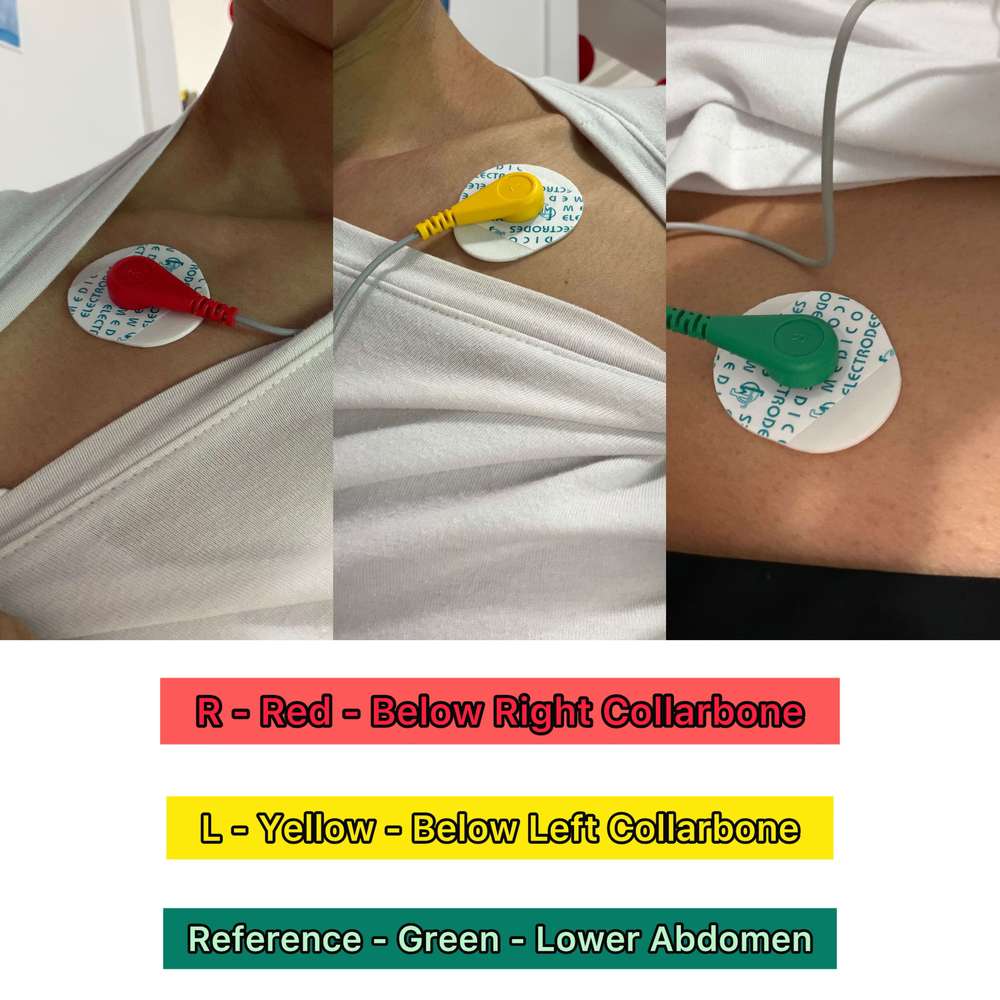
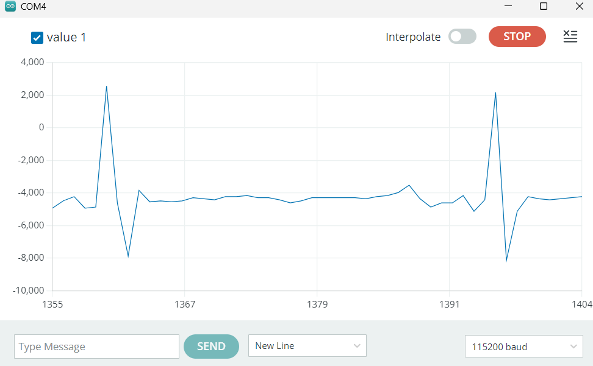

# Phase 4: Raw ECG Signal Acquisition

## Objective

The objective of Phase 4 was to configure the MAX30003 for ECG acquisition, connect a three-electrode cable, read raw ECG samples, and display the resulting waveform in Arduino Serial Plotter.

Previous testing confirmed basic SPI communication with the MAX30003. This phase progressed from device detection to the acquisition of a biological electrical signal.

## Hardware Used

- ESP32-based Nano microcontroller board
- ProtoCentral MAX30003 ECG breakout
- SparkFun three-connector electrode cable
- Three disposable snap electrodes
- Solderless breadboard
- Jumper wires
- USB data cable
- Battery-powered laptop for body-connected testing

The OLED remained physically connected to the prototype for later integration, but it was not controlled by the Phase 4 program.

## MAX30003 Wiring

| MAX30003 connection | Microcontroller connection | Function |
|---|---|---|
| VCC | 3.3V | Power |
| GND | GND | Common electrical reference |
| SCK | D13 | SPI clock |
| MOSI/SDI | D11 | Data from microcontroller to MAX30003 |
| MISO/SDO | D12 | Data from MAX30003 to microcontroller |
| CS0/CSB | D10 | SPI chip select |
| INT1/INTB | D2 | Interrupt/data-ready connection |

## Electrode Cable

The electrode cable uses a 3.5 mm plug and three snap-style connectors.

The electrode arrangement used during testing was:

| Connector | Placement |
|---|---|
| Red R | Below the right collarbone |
| Yellow L | Below the left collarbone |
| Green reference | Lower-right abdomen |

The red and yellow leads measured the differential ECG signal. The green reference lead helped reduce common electrical noise and interference.

## Software Setup

The ProtoCentral MAX30003 library and the Arduino SPI library were used to communicate with the ECG breakout.

The Phase 4 program:

1. Started serial communication at 115200 baud
2. Initialized the SPI interface
3. Verified communication with the MAX30003
4. Configured the MAX30003 for ECG acquisition
5. Read raw ECG samples
6. Printed the samples through the serial connection
7. Displayed the samples in Serial Plotter

The rate of displayed samples was reduced during testing to make the waveform easier to observe. The MAX30003 continued to be read regularly to avoid overflowing its internal data buffer.

## Source Code

The Phase 4 acquisition sketch is available here:

[View the raw ECG acquisition sketch](../code/phase-4-raw-ecg/max30003-ecg-plotter.ino)

## Complete Prototype

The complete breadboard prototype includes the ESP32-based microcontroller, OLED, MAX30003 ECG breakout, electrode cable, and disposable electrodes.

## MAX30003 Wiring

This close-up documents the power, ground, SPI, chip-select, and interrupt connections used during ECG acquisition.

## Electrode Cable

The three-lead cable connects to the MAX30003 through its 3.5 mm electrode jack.

## Electrode Placement

Three-electrode configuration used during ECG acquisition. The red and yellow leads provided the differential signal, while the green reference lead helped reduce common electrical noise.

## Raw ECG Result

Serial Plotter displayed a mostly stable baseline with regularly repeating sharp complexes. These repeating complexes were consistent with the MAX30003 acquiring an ECG-like biological signal.

Some peaks appeared shorter than others. Possible causes included:

- Reducing the number of samples displayed
- Small body or cable movements
- Changes in electrode contact
- Breathing
- Environmental electrical interference
- Serial Plotter's limited visual resolution

The signal was suitable for continuing to heartbeat detection and BPM calculation.

## Troubleshooting and Adjustments

The original serial output appeared too quickly in both Serial Monitor and Serial Plotter. The program was adjusted so that the MAX30003 continued to be read frequently while only selected samples were printed.

This made the graph easier to observe without intentionally allowing the sensor's internal data buffer to overflow.

Additional signal-quality steps included:

- Using fresh electrodes
- Pressing each electrode firmly against the skin
- Remaining still during recording
- Supporting the cable so it did not pull on the electrodes
- Keeping the system away from mains-powered equipment

## Result

Phase 4 was completed successfully.

The project progressed from basic MAX30003 communication to continuous raw ECG acquisition. The microcontroller received samples through SPI and transmitted them to Serial Plotter, where repeating ECG-like complexes were visible.

## Skills Practiced

- Biosignal acquisition
- SPI sensor communication
- ECG electrode preparation and placement
- Real-time serial data streaming
- Signal visualization
- Sampling-rate and output-rate management
- Motion-artifact recognition
- Electrical-noise troubleshooting
- Safe body-connected prototype testing
- Technical documentation

## Safety and Limitations

Body-connected testing was performed using a laptop operating from its internal battery with its charger disconnected.

This project is intended for education, experimentation, and engineering development only. It is not a certified medical device and must not be used for diagnosis, health monitoring, or emergency decision-making.

## Next Phase

The next phase will detect individual heartbeats, measure the time between successive peaks, calculate heart rate in beats per minute, and evaluate the stability of the BPM measurement.
