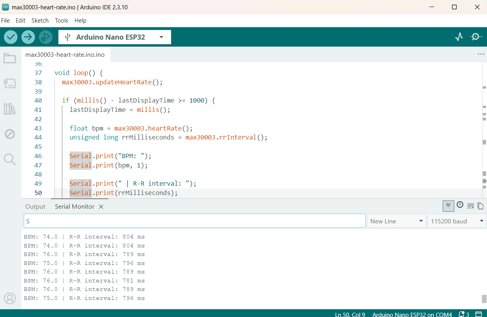
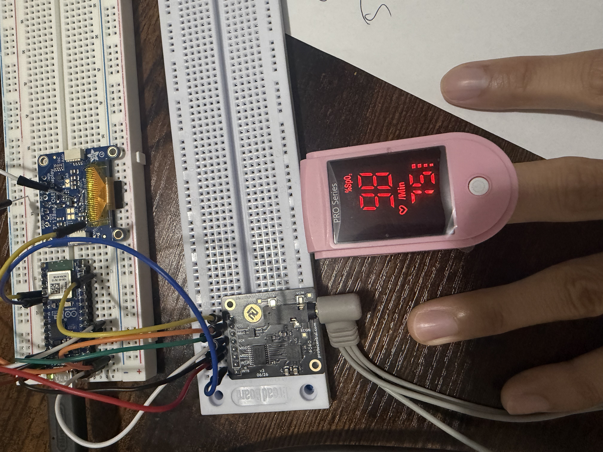
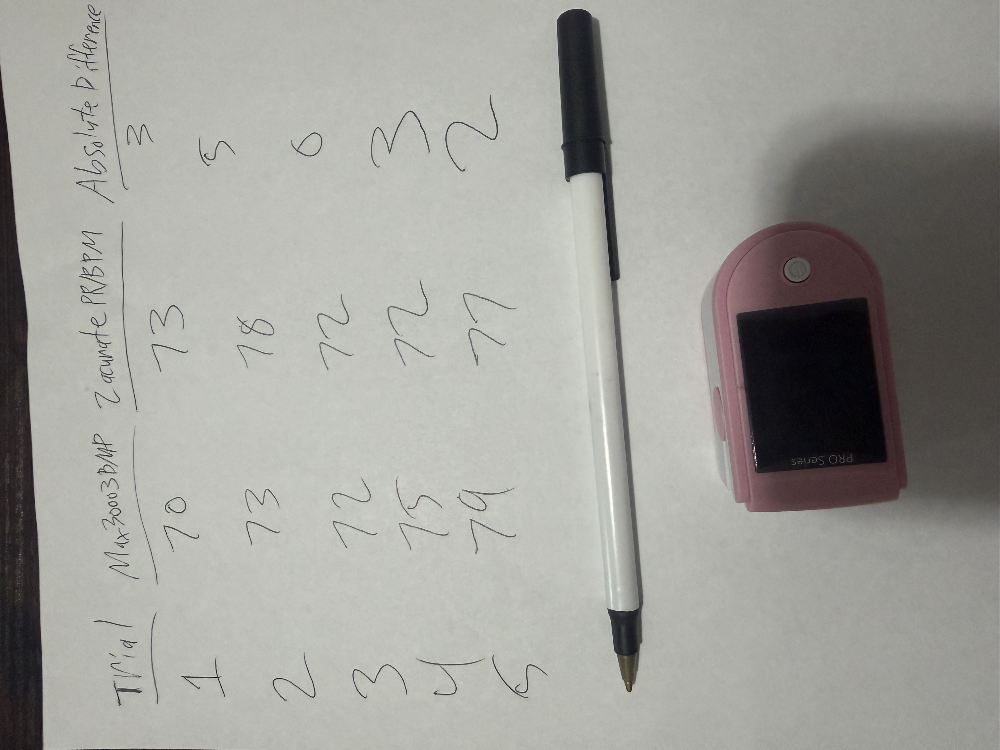

# Phase 5: Heart-Rate and R–R Interval Measurement

## Objective

The objective of Phase 5 is to detect individual heartbeats from the ECG signal, measure the time between consecutive beats, and calculate heart rate in beats per minute.

## Starting Point

Before beginning Phase 5, the following milestones had been completed:

- The ESP32-based microcontroller was configured successfully.
- The OLED was detected at I2C address `0x3D`.
- Basic SPI communication with the MAX30003 was confirmed.
- The MAX30003 produced a repeating raw ECG waveform in Serial Plotter.
- The three-electrode cable and disposable electrode pads were connected and tested.

## Hardware Used

- ESP32-based Nano microcontroller board
- ProtoCentral MAX30003 ECG breakout
- Three-electrode sensor cable
- Disposable ECG electrode pads
- Solderless breadboard
- Jumper wires
- USB-C data cable
- Battery-powered computer for body-connected testing

## Software Used

- Arduino IDE
- ProtoCentral MAX30003 library
- Serial Monitor
- Phase 5 heart-rate test sketch

## R–R Interval

The R–R interval is the amount of time between two consecutive R peaks in an ECG waveform. R peaks are the prominent peaks associated with individual heartbeats.

The interval is measured in milliseconds. Heart rate can be estimated using:

`BPM = 60000 / R–R interval in milliseconds`

For example, an R–R interval of 1000 milliseconds corresponds to approximately 60 BPM.

## Test Procedure

1. The MAX30003 and microcontroller wiring were inspected.
2. Fresh electrode pads were attached to clean, dry, intact skin.
3. The computer charger and other mains-powered accessories were disconnected.
4. The Phase 5 heart-rate sketch was uploaded.
5. Serial Monitor was opened at `115200` baud.
6. The subject remained seated and still while the ECG signal stabilized.
7. BPM and R–R interval readings were observed.
8. Stable readings were recorded for later evaluation.
9. An independent fingertip pulse-oximeter comparison was planned.

## Initial Success Criteria

A reasonable initial result should meet the following conditions:

- BPM does not remain permanently at zero.
- BPM remains within a believable resting range.
- The R–R interval changes consistently with BPM.
- Readings do not jump wildly every second.
- Repeated heartbeats continue to be detected.
- The prototype reading is reasonably close to an independent reference.

## Current Result

The MAX30003 successfully detected heartbeats and produced BPM and R–R interval measurements. Five trials were compared with the pulse-rate measurement from a Zacurate Pro Series 500DL fingertip pulse oximeter. The comparison was performed as an informal engineering test and not as medical validation.

## Test Evidence

## Planned Comparison Test

The MAX30003 BPM will be compared with the pulse-rate reading from a consumer fingertip pulse oximeter.

The pulse oximeter's `PR` or `BPM` measurement will be used. The oxygen-saturation value (`SpO2%`) will not be used for the heart-rate comparison.

| Trial | MAX30003 BPM | Oximeter Zacurate PR/BPM | Absolute Difference |
|---|---:|---:|---:|
| 1 | 70 | 73 | 3 |
| 2 | 73 | 78 | 5 |
| 3 | 72 | 72 | 0 |
| 4 | 75 | 72 | 3 |
| 5 | 79 | 77 | 2 |

The absolute difference will be calculated using:

`Absolute difference = |MAX30003 BPM - oximeter BPM|`

## Evidence to Add

- [x] Screenshot of stable BPM and R–R interval readings
- [x] Photograph of the pulse-oximeter comparison
- [x] Results from five comparison trials
- [x] Photograph or digital copy of the testing notes
- [x] Exact Phase 5 test sketch

## Skills Practiced

- ECG signal acquisition
- Heartbeat detection
- Timing measurement
- R–R interval interpretation
- Heart-rate calculation
- Serial data monitoring
- Experimental comparison
- Technical documentation

## Limitations

This is an experimental engineering prototype, not a certified medical device. A consumer pulse oximeter provides only an informal comparison and does not constitute medical validation.

Readings may be affected by electrode contact, movement, electrical interference, signal-processing settings, and differences between the measurement methods.

## Safety

Body-connected testing is performed only while the computer is operating on battery power with its charger disconnected. The prototype must not be connected to unknown or unsafe mains-powered equipment while electrodes are attached to a person.

The system is intended for education and experimentation only. It must not be used for diagnosis, emergency decisions, or medical treatment.

## Project Files

- [Phase 5 heart-rate sketch](../code/phase-5-heart-rate/max30003-heart-rate.ino)
- [Phase 5 images](../images/phase-5)
- [Phase 4 raw ECG documentation](docs/phase-4-raw-ecg.md)
