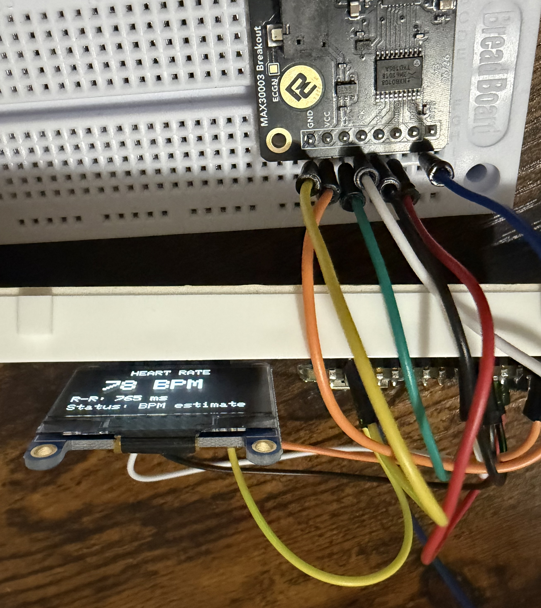
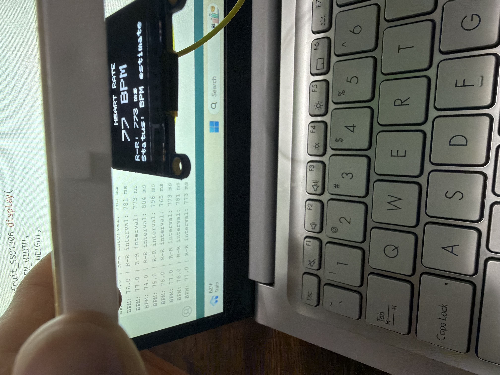

# Phase 6: OLED Heart-Rate Integration

## Objective

The objective of Phase 6 was to combine MAX30003 heart-rate measurement with the OLED display. Previous phases tested the OLED and ECG sensor independently.

## Hardware

- ESP32-based Nano microcontroller board
- ProtoCentral MAX30003 ECG breakout
- Adafruit 1.3-inch 128x64 OLED
- Three-electrode ECG cable
- Disposable electrode pads
- Breadboard and jumper wires

## Communication Interfaces

The MAX30003 communicates with the microcontroller through SPI.

The OLED communicates through I2C using:

- SDA: A2
- SCL: A3
- I2C address: `0x3D`

## Development Procedure

1. The OLED was tested with a simulated value of 72 BPM.
2. The simulated value was replaced with live MAX30003 heart-rate data.
3. The MAX30003 heartbeat-processing function continued running in the main loop.
4. The OLED was refreshed once per second using a non-blocking `millis()` timer.
5. BPM and R–R interval values were displayed on both the OLED and Serial Monitor.
6. An acquiring screen was displayed before a plausible BPM estimate became available.

## Result

The OLED successfully displayed live BPM and R–R interval estimates from the MAX30003. The OLED and Serial Monitor displayed matching values and continued updating without freezing.

Because disconnected electrodes can collect electrical noise and produce false heartbeat detections, the display describes the value as a BPM estimate. More complete signal-quality handling will be developed in the next phase.

## Evidence

## Skills Practiced

- Integrating I2C and SPI peripherals
- Combining independently tested hardware modules
- Non-blocking timing with `millis()`
- OLED interface design
- Live sensor-data visualization
- Troubleshooting false detections from floating ECG inputs

## Limitations

The current range check determines only whether the calculated BPM is numerically plausible. It does not confirm clean electrode contact or distinguish a real ECG waveform from electrical noise.

## Safety

Body-connected testing was performed with the computer operating on battery power and the charger disconnected. This prototype is experimental and is not a medical device.

## Project Files

- [Phase 6 sketch](../code/phase-6-oled-heart-rate/phase-6-oled-heart-rate.ino)
- [Phase 6 images](../images/phase-6)
